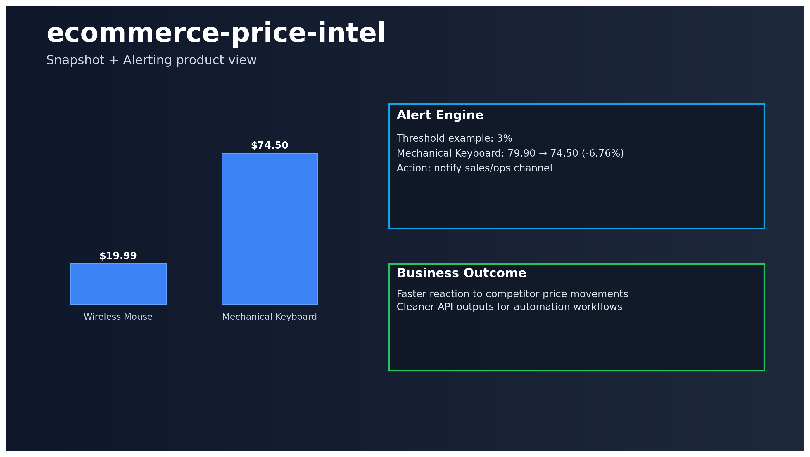

# 🛒 ecommerce-price-intel

[](https://github.com/keremercin/ecommerce-price-intel/actions/workflows/ci.yml)


Price intelligence starter focused on practical e-commerce monitoring workflows.

## Problem
Teams need fast visibility into price movements, but manual tracking is slow and inconsistent.

## Solution
This project provides:
- normalized price-series ingestion flow,
- latest snapshot endpoint,
- threshold-based alert detection,
- dashboard-ready outputs.

---

## Product view



---

## API

- `GET /health`
- `GET /v1/sample-data`
- `GET /v1/latest`
- `GET /v1/alerts?pct_threshold=5`

Swagger: `http://localhost:8100/docs`

---

## Quickstart

```bash
cp .env.example .env
python -m venv .venv
source .venv/bin/activate
pip install -e .[dev]

uvicorn price_intel.api.main:app --reload --port 8100
streamlit run dashboard.py --server.port 8502
```

---

## What employers can see here

- API + analytics logic shipped together
- alerting-oriented data model design
- practical dashboard surface for non-technical users
- engineering hygiene (tests + CI)

---

## Repository structure

```text
src/price_intel/
├─ api/
├─ collectors/
├─ pipeline/
│  ├─ transform.py
│  └─ analytics.py
└─ config.py
```

---

## Docs

- Architecture: `docs/ARCHITECTURE.md`
- Case study: `docs/CASE_STUDY.md`
- 60s demo script: `docs/DEMO_SCRIPT_60S.md`

---

## Next roadmap

- real Playwright-based collectors
- scheduled daily ingestion
- notification channel integration (Slack/Telegram/Email)
