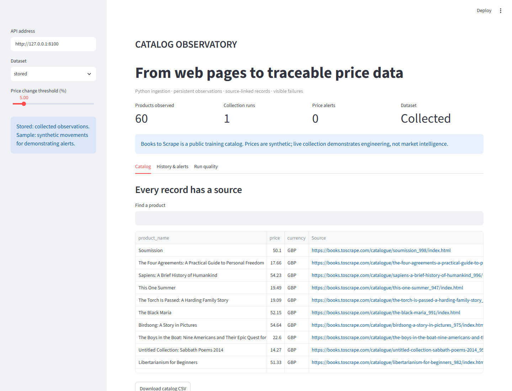
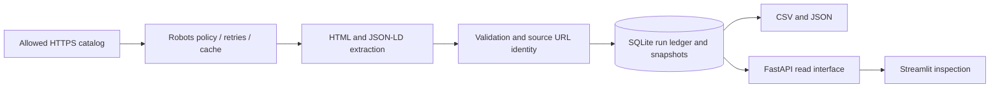

# Catalog Observatory

[](https://github.com/keremercin/ecommerce-price-intel/actions/workflows/ci.yml)

A Python catalog ingestion pipeline with durable crawl progress, historical snapshots, a read-only FastAPI interface and a Streamlit inspection dashboard.

**Evidence, not a customer claim:** the collector makes real HTTP requests to [Books to Scrape](https://books.toscrape.com), a public scraping sandbox. Its products and prices are synthetic. This repository demonstrates extraction and data engineering; it does not demonstrate commercial price-monitoring results.



## What it does

- Discovers pagination and extracts HTML product cards or JSON-LD Product offers.
- Normalizes names, validates non-negative finite prices and currency fields, and preserves source URLs.
- Deduplicates products by stable source URL within a run; retains observations across runs.
- Restricts requests to the configured HTTPS origin, rejects redirects and checks robots.txt.
- Retries transient transport/server failures with bounded backoff; caches successful responses.
- Commits each page's observations, visited-page record and continuation cursor together in SQLite.
- Resumes interrupted runs without silently claiming incomplete pagination is complete.
- Exports CSV/JSON and exposes stored data, alerts and run diagnostics through an API.

## Run locally

Python 3.10+ is required. From the repository root:

```bash
python -m venv .venv
# Linux/macOS: source .venv/bin/activate
# PowerShell: .venv\Scripts\Activate.ps1
python -m pip install -e ".[dev]"
python scripts/collect_catalog.py --pages 3
python -m uvicorn price_intel.api.main:app --port 8100
```

In a second terminal with the same environment:

```bash
python -m streamlit run dashboard.py --server.port 8502
```

Open http://localhost:8502. The default dataset is **stored observations**, not sample data. Before collection it is empty. The dashboard offers an explicitly labelled synthetic sample mode.

The default database is `data/catalog.db`; set `PRICE_INTEL_DB_PATH` to use another database for the API. The collector accepts `--database`, `--output`, `--resume RUN_ID` and `--refresh`. Resume the ID printed by collection to continue the next bounded batch. Each invocation accepts 1–50 pages. Refresh bypasses cached responses, including cached pages whose layout could not be parsed.

## Architecture


```mermaid
flowchart LR
    Source[Allowed HTTPS catalog] --> HTTP[Robots policy / retries / cache]
    HTTP --> Parser[HTML and JSON-LD extraction]
    Parser --> Validation[Validation and source URL identity]
    Validation --> DB[(SQLite run ledger and snapshots)]
    DB --> Export[CSV and JSON]
    DB --> API[FastAPI read interface]
    API --> Dashboard[Streamlit inspection]
```

The collector is a local CLI/library. The API does not accept arbitrary URLs or launch crawls. Collection errors remain in the durable run ledger; parse warnings are visible rather than silently discarded.

## API

- `GET /health`, `GET /version`
- `GET /v1/latest?mode=stored`
- `GET /v1/alerts?pct_threshold=5&mode=stored`
- `GET /v1/catalog/history`
- `GET /v1/catalog/runs`
- `GET /v1/sample-data` — deliberately synthetic

Responses use `{status, data, meta, error}`. The dashboard unwraps `data`. `latest` and `alerts` accept `mode=sample` explicitly; their default now reads SQLite rather than the old hard-coded sample dataset.

## Recorded example

The checked-in `reports/catalog/` contains an actual bounded HTTP collection: **3 pages, 60 product rows, 4 HTTP requests, no recorded parse errors**. The run is marked **partial**, because more pages remain. Those counts describe this run only. They are not a throughput benchmark, service reliability metric or customer outcome. Inspect `run.json` for the run ID and `catalog.csv` / `catalog.json` for source-linked observations.

## Verification

```bash
python -m pytest -q
python -m ruff check src/price_intel/catalog.py scripts/collect_catalog.py tests/test_catalog.py tests/test_api.py src/price_intel/api/main.py dashboard.py
```

Current local result: **20 tests passed**. Tests cover extraction, malformed records, JSON-LD identity, URL restrictions, retry/robots behavior, cache replay, failure/resume, pagination loops, rejected pagination and stored API behavior. HTTP failure scenarios use MockTransport; they do not establish live site reliability. The dashboard was also opened in Chromium against the running local API: the stored mode displayed 60 products, one partial run and source-linked records; the Run quality tab rendered. This is local smoke verification, not hosted deployment verification.

## Limits

- The built-in source is a sandbox. Other sites need an appropriate parser and source permission/policy review.
- Browser rendering is an injectable extension point; no bundled Playwright adapter is implemented yet.
- Requests have timeouts and stop streaming when decoded response bytes exceed 2 MB; oversized responses are not cached.
- This is a single-process collector. Concurrent collection scheduling and distributed locking are not implemented.
- Product identity is URL-based; variant matching across unrelated stores is not implemented.
- Alerting is a percentage threshold over stored observations, not a trained anomaly model. Fresh collection at separate times is needed to measure real changes.
- The default dashboard/API configuration is for local inspection; hosted authentication and deployment operations are outside the current implementation.
