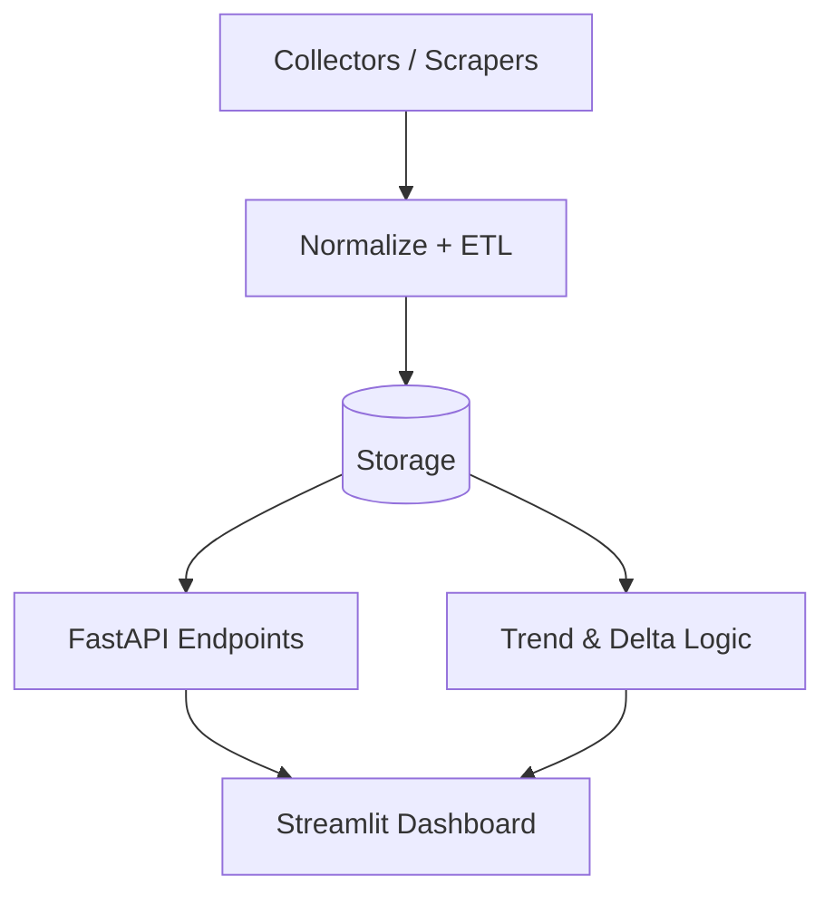

# Architecture

## Planned modules
- `collectors/` product source connectors
- `pipeline/` data normalization + enrich
- `api/` serving for dashboard and downstream integrations
- `dashboard.py` quick UI for price trends
